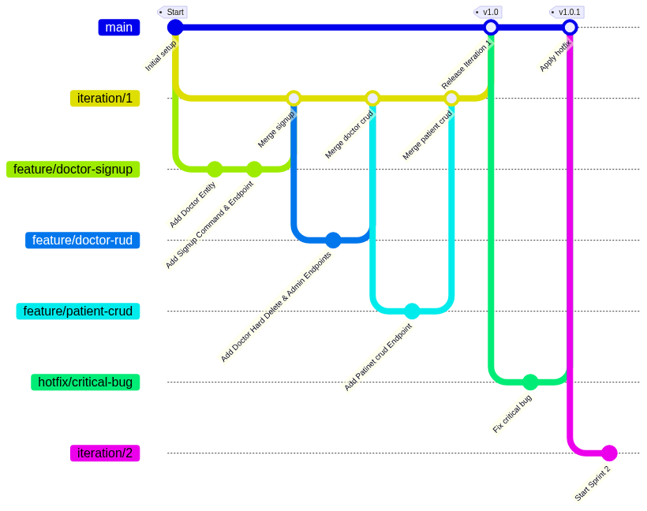

# ClinicManagement-Botcamp1405-01

ورک فلو اختصاصی تیم به همراه فیچر های دور اول توسعه

# 1. Update your local copy of the feature branch
git fetch origin  
git checkout feature/patient-crud  
git pull origin feature/patient-crud  

# 2. Create your personal developer branch off feature/patient-crud
git checkout -b patient-crud/farajpour  

# 3. Work, stage, and commit
git add .  
git commit -m "feat: add update logic to PatientService"  

# 4. Push your branch to remote and set tracking
git push -u origin patient-crud/farajpour  

# --- Open Pull Request panel in github
Base = feature/patient-crud | Compare = patient-crud/farajpour   

# 5. If reviewer requests changes:
git add .  
git commit -m "refactor: adjust validation logic per PR comment"  
git push origin patient-crud/farajpour  

# 6. Local cleanup
git checkout feature/patient-crud  
git pull origin feature/patient-crud  
git branch -d patient-crud/farajpour (this is optional)  
